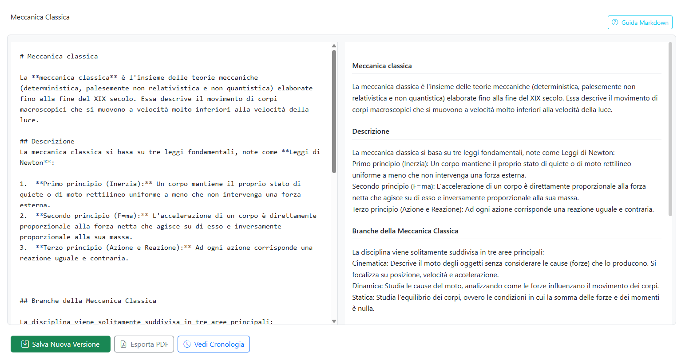
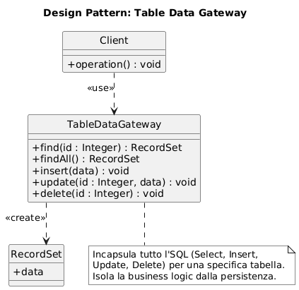
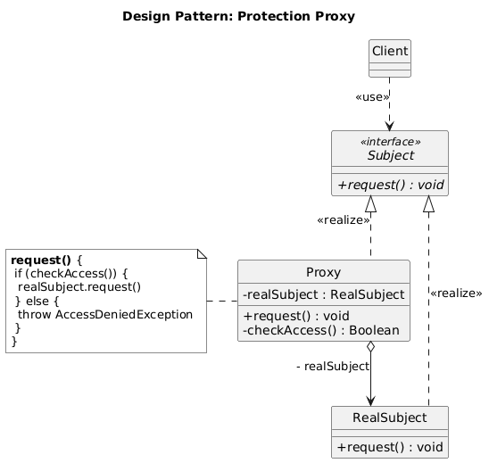
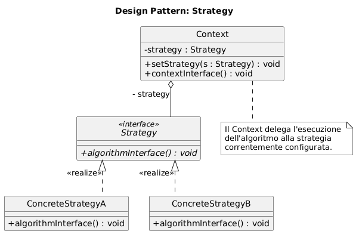
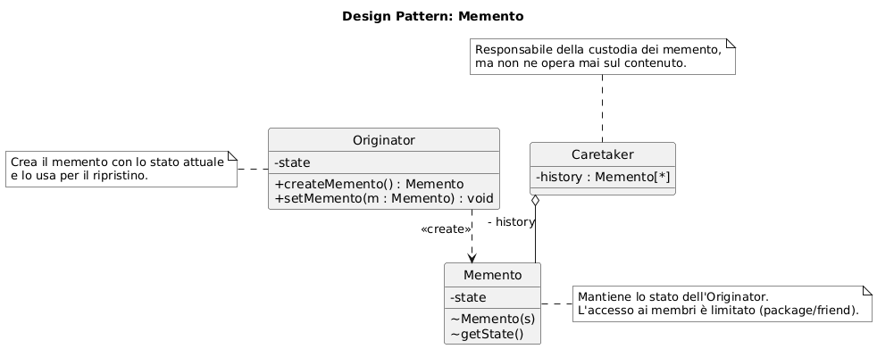
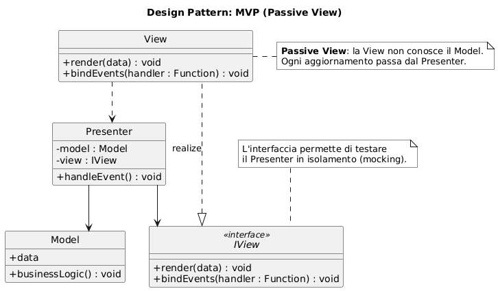

# Wiki Collaborativo Appunti

> *A collaborative wiki for sharing and versioning university lecture notes, written in plain PHP 8 and vanilla JavaScript with no frameworks, so that the design patterns (Table Data Gateway, Protection Proxy, Strategy, Memento, MVP) stay visible in the code. Built as a Software Engineering exam project at the University of Parma, then hardened after submission. Runs with a single Docker Compose command. Documentation is in Italian.*

Applicazione web per condividere, modificare e versionare appunti universitari, organizzati per corso e argomento. Ogni salvataggio genera una nuova versione consultabile e ripristinabile dalla cronologia.

Nato come progetto d'esame di Ingegneria del Software (Università di Parma), realizzato senza framework per rendere espliciti i design pattern usati. Dopo la consegna è stato ripreso e sistemato: alcune scorciatoie accettabili in un contesto accademico (password senza salt, identità dell'utente fidata dal client, credenziali nel codice, nessun test automatico) sono state corrette senza cambiare l'architettura. I dettagli sono in [Revisione post-consegna](#revisione-post-consegna).



## Funzionalità

- **Visitatore**: naviga corsi e argomenti, legge gli appunti, cerca per titolo, esporta in PDF.
- **Studente** (registrato): crea appunti in Markdown, salva nuove versioni, consulta la cronologia e ripristina versioni precedenti.
- **Amministratore**: gestisce corsi, argomenti e appunti (creazione, rinomina, eliminazione a cascata di appunti, versioni e file).

## Stack

| Livello | Tecnologia |
| --- | --- |
| Frontend | HTML, JavaScript vanilla (ES2015+), Bootstrap 5, Showdown (Markdown → HTML) |
| Backend | PHP 8.2 puro, API REST JSON, sessioni PHP |
| Database | MySQL 8 (metadati) + file system (contenuto Markdown degli appunti e delle versioni) |
| Deploy | Docker Compose: `frontend` (httpd), `backend` (php:apache), `db` (mysql) |
| Test | PHPUnit 10, eseguito in container |

## Architettura e pattern

Backend: `Router → Controller → Proxy → Gateway → PDO / file system`.

- **Table Data Gateway** (`Model/Gateway/`): una classe per tabella (`CoursesGateway`, `ArgomentiGateway`, `NotesGateway`, `VersionsGateway`, `UserGateway`), tutte figlie di `AbstractGateway`, che traduce i criteri in SQL parametrizzato.
- **Protection Proxy** (`Model/Gateway/ProxyProtection/`): ogni gateway è incapsulato in un proxy che riceve l'utente in sessione e autorizza le operazioni in base al ruolo. I controller non conoscono la logica dei permessi.
- **Strategy + Query Object** (`Model/Strategy/`, `Model/Core/`): i filtri (`IdFilter`, `SearchFilter`, `EmailFilter`, `IdInFilter`, ...) costruiscono un `QueryObject` di `Criteria`; il gateway lo trasforma in clausola `WHERE`.
- **Memento** (`Model/Memento/`): `NoteMemento` congela lo stato di un appunto; `VersionsGateway` lo archivia su file e nella tabella `versioni`, da cui può essere ripristinato.
- **Factory** (`Model/Core/DatabaseFactory.php`): creazione della connessione PDO.
- **CascadeService**: coordina le eliminazioni a cascata (corso → argomenti → appunti → versioni → file) in transazione.

Diagrammi dei pattern (dalla relazione tecnica, in forma generica):

<table>
  <tr>
    <td align="center"></td>
    <td align="center"></td>
  </tr>
  <tr>
    <td align="center"></td>
    <td align="center"></td>
  </tr>
</table>

Frontend: **Model-View-Presenter** con un `EventEmitter` per il disaccoppiamento (`js/Model/AppModel.js`, `js/View/*`, `js/Presenter/*`).

<p align="center"></p>

La relazione tecnica completa (requisiti, casi d'uso, diagrammi UML, piano di test) e il manuale utente sono in [`docs/`](docs/).

## Avvio

Requisiti: Docker (Desktop o Engine) e una shell Bash (Git Bash, WSL, macOS/Linux).

```bash
chmod +x *.sh
./run_project.sh
```

Lo script crea `project/.env` da `project/.env.example` se manca, prepara lo storage degli appunti e avvia i container.

- Frontend: <http://localhost:8080>
- Backend API: <http://localhost:8000>

Altri script:

- `./stop_project.sh` — ferma i container
- `./reset_all.sh` — ricrea da zero database e storage
- `./run_tests.sh` — esegue i test PHPUnit (accetta le opzioni di phpunit, es. `./run_tests.sh --filter Proxy`)

### Configurazione

Le credenziali del database e l'origine consentita dal CORS stanno in `project/.env` (non versionato). I valori di default in `.env.example` vanno bene per lo sviluppo locale.

## Utenti di prova

Caricati da `project/services/database/configs/02_dump.sql` alla prima creazione del volume MySQL (password memorizzate con bcrypt).

| Ruolo | Email | Password |
| --- | --- | --- |
| Amministratore | admin@unipr.it | Vector! |
| Studente | studente_test1@studenti.unipr.it | Prova1 |
| Studente | studente_test2@studenti.unipr.it | Prova2 |
| Studente | studente_test3@studenti.unipr.it | Prova3 |

## API principali

| Metodo | Endpoint | Ruolo |
| --- | --- | --- |
| GET | `/corsi`, `/argomenti?corso_id=`, `/appunti?argomento_id=`, `/appunto?id=`, `/cerca?q=` | tutti |
| GET | `/appunto/storia?id=`, `/appunto/versione/visualizza?versione_id=` | tutti |
| POST | `/login`, `/logout`, `/register` | tutti |
| POST | `/appunto/crea`, `/appunto/versione/salva`, `/appunto/versione/ripristina` | studente |
| POST / PUT / DELETE | `/corso/*`, `/argomento/*`, `/appunto/modifica`, `/appunto/elimina` | amministratore |

L'identità dell'autore è sempre presa dalla sessione lato server, mai dal body della richiesta.

## Revisione post-consegna

Il progetto è stato sviluppato in poche settimane con l'obiettivo di superare l'esame: l'attenzione era sui pattern e sulla documentazione. Riprendendolo in mano sono stati corretti i difetti più evidenti, mantenendo intatta la struttura documentata nella relazione:

| Difetto originale | Correzione |
| --- | --- |
| Password memorizzate come `sha256` senza salt | `password_hash()` / `password_verify()` (bcrypt) |
| L'id dell'autore arrivava dal body JSON: il Proxy controllava il ruolo ma non l'identità | L'autore è sempre `$_SESSION['user']['id']`; il body viene ignorato |
| Credenziali DB e origine CORS hardcoded nel codice e nel compose | Variabili in `project/.env` (non versionato) con template `.env.example` |
| `debug.php` che esponeva la sessione, `mkdir 0777` | Rimossi / corretti |
| Nessun test automatico (solo il piano di test black-box nella relazione) | Test PHPUnit su Strategy, composizione delle query e Protection Proxy |

Restano volutamente fuori scope le scelte architetturali (assenza di framework e di namespace, autoloader custom, storage su file) perché sono parte di quanto richiesto e valutato all'esame.

## Struttura del repository

```
project/
  backend/      API PHP (Router, Controller, Model, autoload, tests)
  frontend/     SPA statica (MVP)
  services/     schema e dati di test MySQL
  docker-compose.yml, Dockerfile.be, .env.example
appunti_prova/  appunti di esempio copiati nello storage al primo avvio
docs/           relazione tecnica, manuale utente e sorgenti LaTeX
```

## Licenza

Il codice è rilasciato sotto licenza [MIT](LICENSE). Le librerie in `project/frontend/*/vendor/` (Bootstrap, Bootstrap Icons, Showdown) sono anch'esse distribuite sotto licenza MIT dai rispettivi autori.
